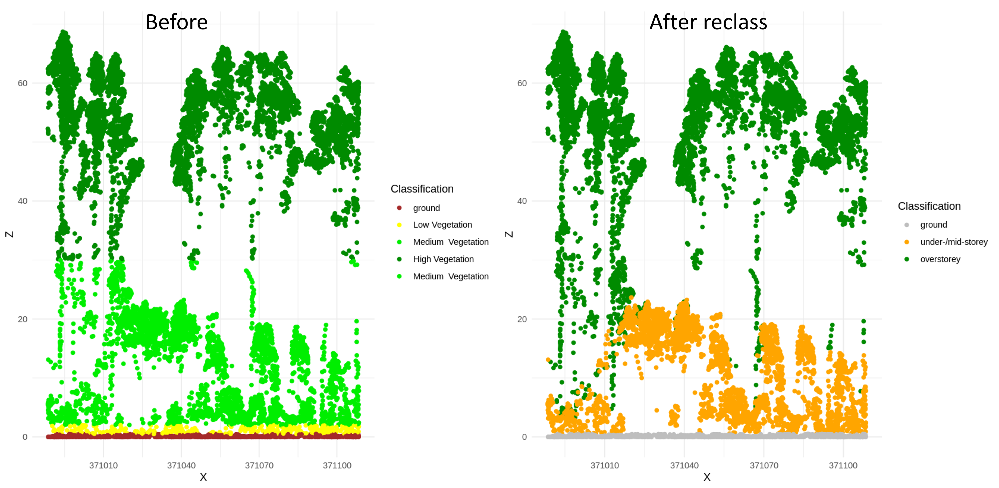
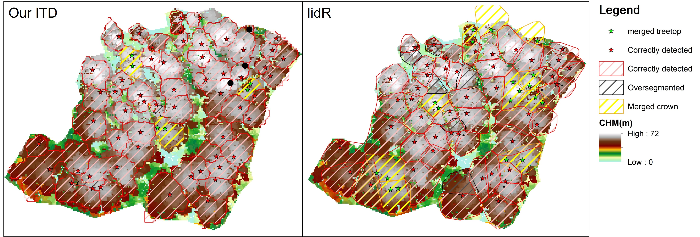
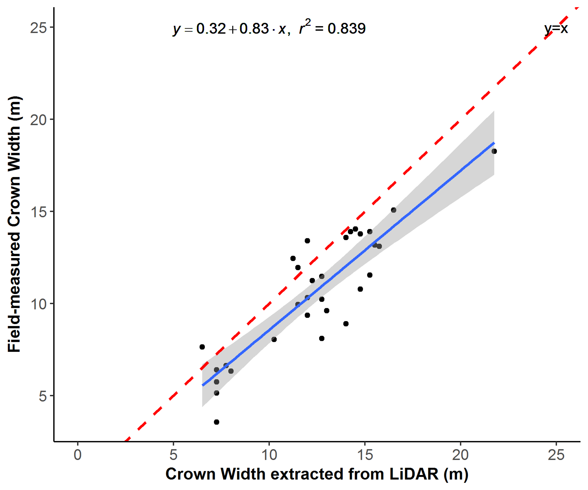
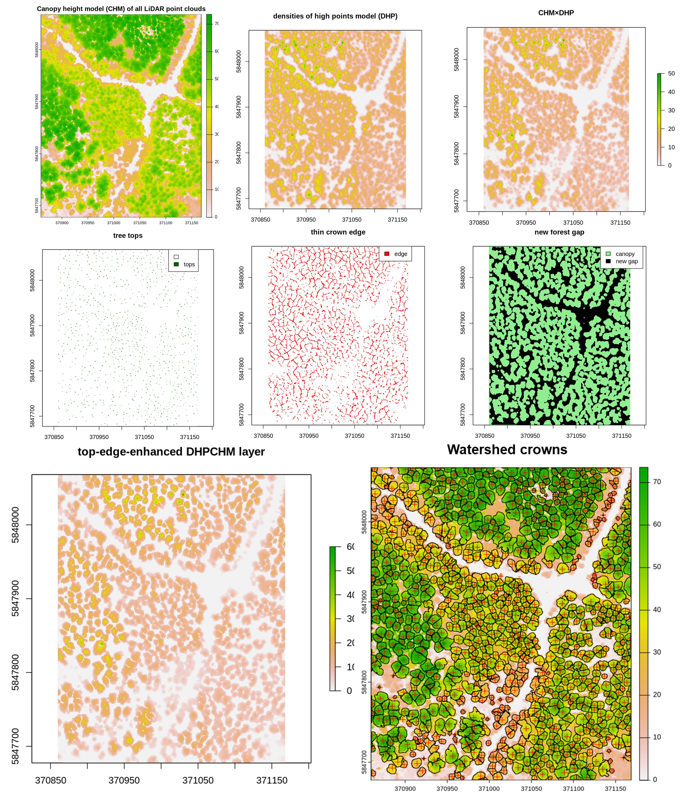

# Individual_Tree_Delineation_in_Broadleaf_forest

This repository provides the code and documentation for the ITD method, crafted to delineate individual trees from Airborne LiDAR datasets. Our approach employs watershed segmentation built on top-edge-enhanced canopy height and density models, specifically tailored for broadleaf forests in Australia.

## Overview

The ITD method offers an advanced approach to segmenting tree crowns in broadleaf forests.

### Highlights:

1. **Reclassification of Vegetation Point Clouds**: Our method effectively segregates vegetation point clouds into under-/mid-storey and overstorey.
   
   
2. **ITD Crown validation**: A comprehensive mapping of Tree crowns delineated using our method.
   

3. **Crown width**: A strong linear relationship between the LiDAR-derived crown width and the crown widths measured in the field (R2 = 0.84).
   

### Workflow:

Our ITD workflow encapsulates the entire process from raw ALS data to final tree crown delineation, including the following steps
---
1. Create a 50cm resolution CHM.
2. Create  an HCBM from the HCB-HT relationship using field data (Figure 1).
3. Identify canopy gaps.
4. Filter out the under-/mid-storey points below the HCBM, retaining only overstorey LiDAR points.
5. Exclude points within canopy gaps.
6. Generate a densities of high points model (DHP) using overstorey crown points.
7. Pinpoint treetops and crown edges via targeted CHM×DHP raster layers.
8. Perform marker-control watershed delineation on a top-edge-enhanced CHM×DHP layer, calculated as:
(CHM×DHP) × (1.2 × treetops) + (CHM×DHP) × (1 - gaps) × (1 - edges) × (1 - treetops)
---
   


## Dependencies:

* lidR
* raster
* EBImage
* spatstat

## Getting Started

1. **Clone the Repository**:
   ```bash
   git clone [repository_link]
   ```

2. **Install Dependencies**:
   ```bash
   # Mention dependencies or setup commands
   ```

3. **Run the ITD Method**:
   ```bash
   # Command to execute the ITD method
   ```

## Documentation

For a detailed understanding of our approach, algorithms, and results, please refer to [link_to_detailed_documentation_or_paper].

## References:

```r
cite
#> Jiang, R. Using LiDAR for landscape-scale mapping of potential habitat for the critically endangered Leadbeater's Possum. Diss. Doctoral dissertation, The University of Melbourne, Australia, 2019. http://hdl.handle.net/11343/234019
```    
- Other important references...

## License

This project is licensed under the MIT License - see the [LICENSE.md](LICENSE.md) file for details.

## Acknowledgements

A special thanks to the contributors, collaborators, and the community for their invaluable feedback and suggestions.

---

**Note**: Make sure to replace placeholders (like `path_to_image`, `repository_link`, etc.) with actual paths or links relevant to your project. This is a basic template and can be expanded or modified based on your project's specific requirements.
