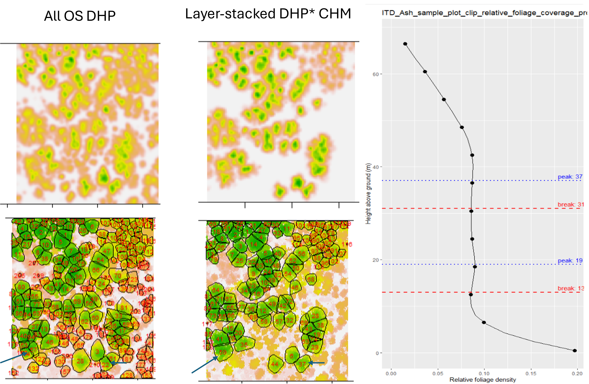

# LiDAR Individual Tree Detection using Layer-Stacked DHP



## Overview

This repository contains an unpublished research prototype for individual tree detection (ITD) and canopy layer separation from airborne LiDAR data.

The workflow was developed for structurally complex forests, particularly tall multi-layered forests where conventional canopy-height-model (CHM) based approaches often struggle to distinguish overstorey and mid-storey vegetation.

Unlike conventional ITD methods that estimate crown base height directly from the canopy height model, this workflow uses a **Vertical Foliage Cover Profile (FCP)** derived from the LiDAR point cloud to identify canopy structural transitions. These transitions are then used to separate overstorey and lower canopy layers prior to crown segmentation.

The method is intended for research discussion and algorithm evaluation rather than operational deployment.

---

## Workflow

```text
Input LAZ from AWS
        ↓
Noise removal
        ↓
DTM generation and height normalization
        ↓
0.5 m CHM generation
        ↓
Vertical foliage profile analysis (New)
        ↓
Detect plot-level canopy break and canopy peak
        ↓
Determine stand type / ash-like tall forest
        ↓
Upper canopy (OS-crown) point extraction
        ↓
Layer-stacked DHP × CHM generation (New)
        ↓
Adaptive treetop detection
        ↓
Marker-enhanced watershed
        ↓
Overstorey crown segmentation
        ↓
Crown-level height distribution analysis
        ↓
Estimate mid-storey reference height per crown
        ↓
Generate mid-storey reference surface
        ↓
Point-cloud reclassification into
lower/mid-storey and overstorey
```

---

## Key Innovations

### 1. Layer-Stacked DHP

The core canopy representation is a **Layer-Stacked Density Height Product (DHP)**.

Instead of using only canopy height, DHP accumulates foliage density information through multiple vertical layers:

```text
DHP = Σ (layer density × chm)
```

where density is calculated independently within each vertical slice.

This representation preserves both:

- canopy height information
- vertical foliage distribution
- canopy structural complexity

and provides a more stable canopy surface for treetop detection in complex forests.

---

### 2. FCP-Based Canopy Layer Separation

A major difference from the previous workflow is that canopy separation is no longer derived directly from CHM-based crown-base-height formulas.

Instead:

1. A plot-level Foliage Cover Profile (FCP) is generated from the normalized LiDAR point cloud.
2. Vertical canopy breaks are identified from the FCP curve.
3. Foliage density peaks are detected.
4. These structural features are used to distinguish overstorey and lower canopy layers.

This approach better reflects the actual vertical forest structure and reduces dependence on local CHM artefacts.

---

### 3. Crown-Based Mid-Storey Reference Surface

After overstorey crowns are segmented:

- crown-level height distributions are analysed
- crown-specific mid-storey reference heights are estimated
- a continuous mid-storey reference surface is generated

The reference surface is then used to classify points into:

- Overstorey
- Lower / Mid-storey
- Ground

without requiring a second crown segmentation pass.

---

## Comparison with Previous Method

The previous version estimated crown base height directly from the canopy height model and relied on iterative crown segmentation.

The current workflow:

- introduces Layer-Stacked DHP
- uses FCP-derived canopy breaks
- performs crown-based mid-storey surface estimation

As illustrated above, the updated workflow produces a more realistic separation of canopy layers in structurally complex forests while reducing crown over-segmentation.


---

## Important Notes

- This code is shared for research discussion only.
- The workflow is an unpublished research prototype.
- It has not been packaged as a general-purpose software tool.
- Input/output paths need to be modified before use.
- Parameters may need adjustment for different forest types, canopy structures, and LiDAR point densities.
- The workflow has primarily been tested on Australian forest datasets.

---

## Research Use

This repository is shared for research discussion and algorithm evaluation.

If you find the workflow useful, please consider acknowledging the repository or citing the methodology where appropriate.

If you share, adapt, or apply this workflow to other forest types or LiDAR datasets, I would greatly appreciate being informed of your experience and results.

For questions, feedback, or collaboration opportunities, please contact:

**Ruizhu Jiang**  
📧 ruizhu.jiang@uq.edu.au
